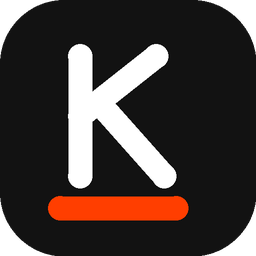
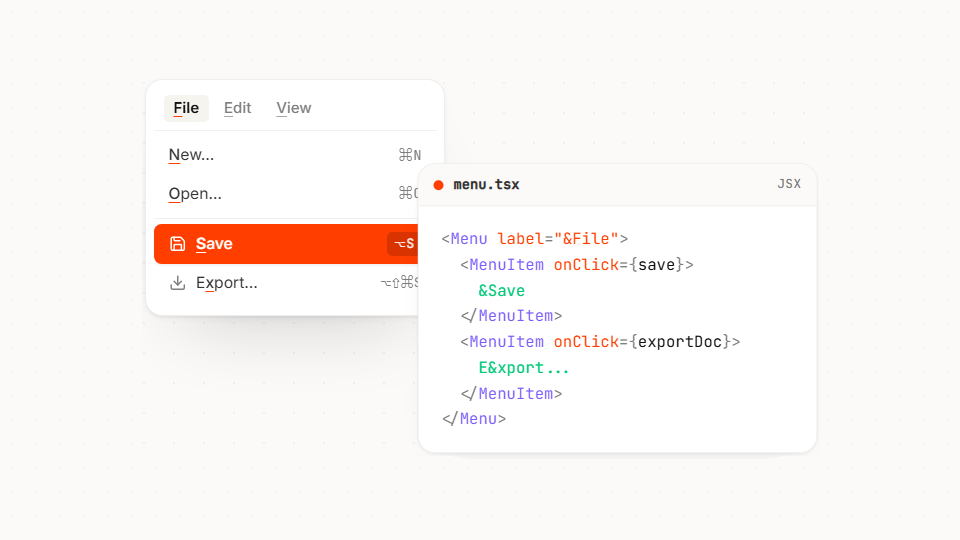

<div align="center">



# react-keybound

**Desktop-grade keyboard interactions for modern React applications.**

[](https://www.npmjs.com/package/react-keybound)
[](https://opensource.org/licenses/MIT)
[](https://keybound.eggwite.moe)

<br />



<br />

### [keybound.eggwite.moe](https://keybound.eggwite.moe)

[Overview](#overview) · [Installation](#installation) · [Quick Start](#quick-start) · [Frameworks](#framework-integration) · [Documentation](#documentation) · [Contributing](#contributing)

</div>

---

## Overview

Desktop-grade keyboard ergonomics for React apps:

- **Mnemonics**: Native `Alt+<key>` accelerators via `&` syntax (`<button>&File</button>`) with semantic underlines.
- **Hotkeys**: Declarative element bindings (`<input hotkey="mod+k" />`).
- **Modal Scoping**: Blocks background shortcuts when dialogs, sheets, or palettes are active.
- **Overlay Hints**: Floating keycap badges on demand (`<KeyboundOverlay />`).
- **Hooks API**: `useMnemonic` and `useHotkey` for dynamic labels and i18n without a build step.
- **Tiny Footprint**: ~7.9 KB gzipped runtime. React peer dependencies only. Zero runtime dependencies.
- **SSR Safe**: Listeners attach in client effects; Next.js, Vite, and Remix compatible.

---

## Installation

```sh
npm install react-keybound
```

---

## Quick Start

### 1. Wrap Your App

```tsx
import { KeyboundProvider } from 'react-keybound';
import type {} from 'react-keybound/jsx';

export function App({ children }: { children: React.ReactNode }) {
  return <KeyboundProvider>{children}</KeyboundProvider>;
}
```

### 2. Add Mnemonics & Hotkeys

With the compiler enabled:

```tsx
export function Toolbar() {
  return (
    <nav>
      {/* Alt+F triggers File, Alt+E triggers Edit */}
      <button onClick={() => openMenu('file')}>&File</button>
      <button onClick={() => openMenu('edit')}>&Edit</button>

      {/* Mod+K (⌘K on macOS, Ctrl+K on Windows/Linux) focuses search */}
      <input hotkey="mod+k" placeholder="Search (⌘K)..." />
    </nav>
  );
}
```

Syntax:

- `&Save` &rarr; <ins>S</ins>ave (`Alt+S`)
- `E&xport` &rarr; E<ins>x</ins>port (`Alt+X`)
- `Save && &Close` &rarr; Save & <ins>C</ins>lose (`Alt+C`, `&&` for literal `&`)

### 3. Hooks (Compiler-Free)

For dynamic strings or runtime translations:

```tsx
import { useMnemonic, useHotkey } from 'react-keybound';

function ActionButton({ text, onAction }: { text: string; onAction: () => void }) {
  const { label, triggerProps } = useMnemonic<HTMLButtonElement>(text, { onAction });
  return <button {...triggerProps}>{label}</button>;
}

function GlobalSearch() {
  const { triggerProps } = useHotkey<HTMLInputElement>('mod+k');
  return <input {...triggerProps} placeholder="Search..." />;
}
```

---

## Framework Integration

### Next.js (`next.config.ts`)

```ts
import { withKeybound } from 'react-keybound/next';

export default withKeybound(
  {},
  {
    components: ['Button', 'Link'],
  },
);
```

### Vite (`vite.config.ts`)

```ts
import { defineConfig } from 'vite';
import react from '@vitejs/plugin-react';
import keybound from 'react-keybound/vite';

export default defineConfig({
  plugins: [keybound(), react()],
});
```

---

## Documentation

- [Interactive Studio](https://keybound.eggwite.moe)
- [Documentation & Guides](https://keybound.eggwite.moe/docs)
- [Examples](https://keybound.eggwite.moe/docs/examples)
- [Behavioral Specification](https://keybound.eggwite.moe/docs/behavior)
- [Agent Guide](https://keybound.eggwite.moe/agents.md)

---

## Contributing

Contributions, issues, and feature requests are welcome.

Visit the [GitHub Repository](https://github.com/Eggwite/keybound) to report bugs, request features, or submit pull requests. See [CONTRIBUTING.md](https://github.com/Eggwite/keybound/blob/main/CONTRIBUTING.md) and [CODE_OF_CONDUCT.md](https://github.com/Eggwite/keybound/blob/main/CODE_OF_CONDUCT.md).

---

## License

[MIT](https://github.com/Eggwite/keybound/blob/main/LICENSE) © [Eggwite](https://github.com/Eggwite)
